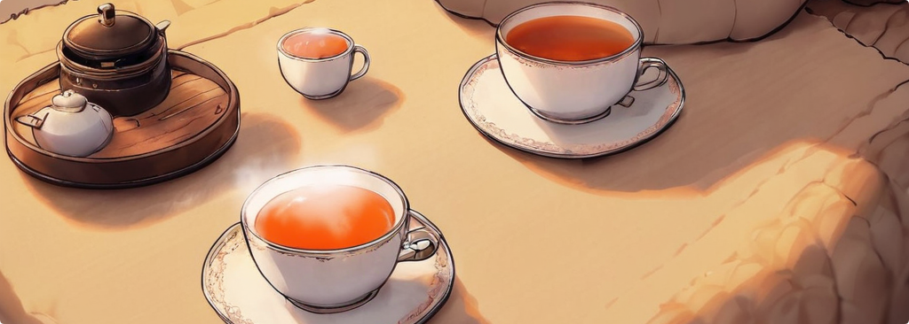

 

    

# QuacksALot Labs

 

· *think, make, be creative on the path of retry and fail* ·

##

 

This is the github oranization of QuacksALot Labs. This is mostly a for haveing fun projects in a seperate space and organize them here.

Or in simple. This is just to have a organization like structure to work on personal projects and fool around with the abilities a github organization has.

 

## 🤝 Contributing

If you would like to contribute to any of the public projects feel free to fork them and take a look at their lisenses. Then work on what you want to contibute and make a pull request.

All projects here are free time work and I cannot always maintain them. But I will take a look on them from time to time.

[back to top ↑](#user-content-top)

> Banner image is made with ai